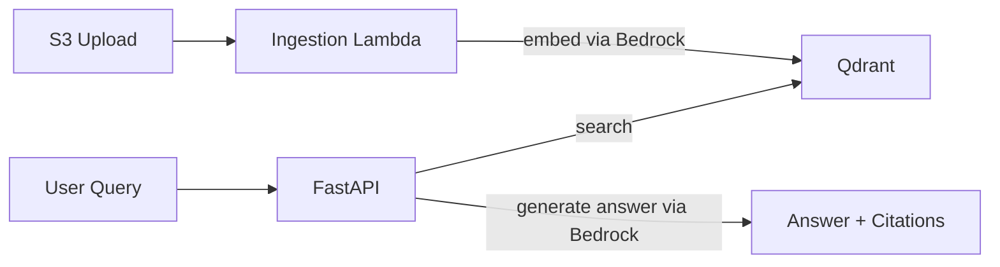

# RAG Starter

Production-ready starter for deploying a RAG question-answering system into your own AWS account. Upload documents, ask questions in plain English, get answers grounded in your content — with citation tracing, refusal behavior, and full Terraform provisioning included.

## Who This Is For

- AI startups selling to enterprise that need customer-deployable, auditable RAG infrastructure
- Platform and infrastructure engineers adding AI capabilities to existing AWS environments
- Teams stuck on security reviews, hallucination control, or "it works on my laptop" deployment

## How It Works



- Documents uploaded to S3 trigger the ingestion Lambda, which chunks and embeds them via AWS Bedrock.
- Embeddings are stored in Qdrant, a vector database that runs locally or as a managed service.
- The FastAPI service accepts natural-language queries, retrieves the most relevant chunks, and uses a Bedrock LLM to produce an answer with traceable citations.
- Out-of-scope queries are refused rather than hallucinated.

## What You Get

- Semantic search with citation tracing back to source chunks
- Refusal behavior for out-of-scope queries
- Zero-credential demo mode — try the full API without Docker or AWS
- Terraform modules for staging and production deployment
- S3-triggered ingestion Lambda with automatic embedding
- Full test suite (unit + integration)

## Start Here

Use this order:

1. Clone and verify the repo locally.
2. Run the API locally if you want the runtime workflow.
3. Use the AWS deployment guide when you are ready to deploy the full stack.

## Quick Start

The fastest way to prove the repo works after cloning is to run the local test suites first.

```bash
# From the repository root
cp .env.example .env
cd src && uv sync
cd ..

# Verify the codebase locally
task test:unit
task local:test:integration
```

`uv` will use Python 3.11+ for this workspace, even if your system default `python3` points to an older version. The pinned version for this repo is declared in [`.python-version`](.python-version).

The only supported uv workspace root is `src/pyproject.toml`.

## What Is In The Repo

- `src/api/`: FastAPI service
- `src/ingestion/`: ingestion Lambda
- `src/shared/`: shared utilities
- `iac/terraform/`: AWS infrastructure modules and example environments

## Local API Runtime

Running the API locally is optional for the public quick-start check. This path uses the local Qdrant container plus live AWS Bedrock access.

Required environment variables in [`.env.example`](.env.example):

- `AWS_REGION`
- `BEDROCK_EMBED_MODEL_ID`
- `BEDROCK_LLM_MODEL_ID`

```bash
# From the repository root
cp .env.example .env
cd src && uv sync
cd ..

task local:api:up
task local:api:health
task local:api:query QUERY="What is the refund policy?"
```

## Local Ingestion

```bash
# From the repository root
task local:sam:up
task local:sam:build
task local:sam:invoke
```

## Documentation

- [Docs Index](docs/README.md)
- [AWS Deployment](docs/AWS_DEPLOYMENT.md)
- [API Service](docs/api/API_README.md)
- [API Local Development](docs/api/API_LOCAL_DEV.md)
- [Ingestion Service](docs/ingestion/INGESTION_README.md)
- [Ingestion Local Development](docs/ingestion/INGESTION_LOCAL_DEV.md)
- [API Tests](src/api/tests/README.md)
- [Ingestion Tests](src/ingestion/tests/README.md)
